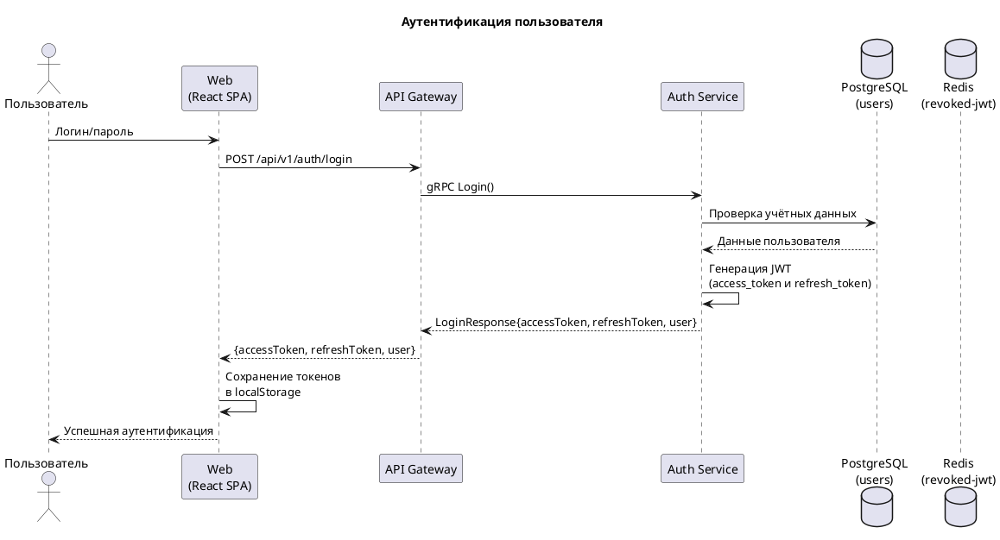
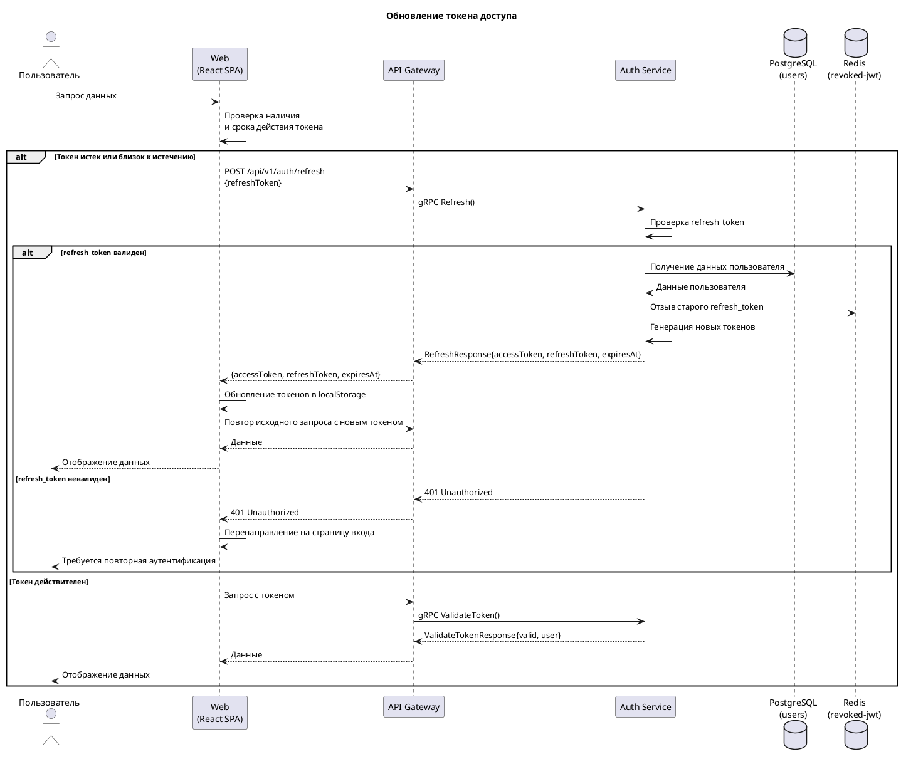
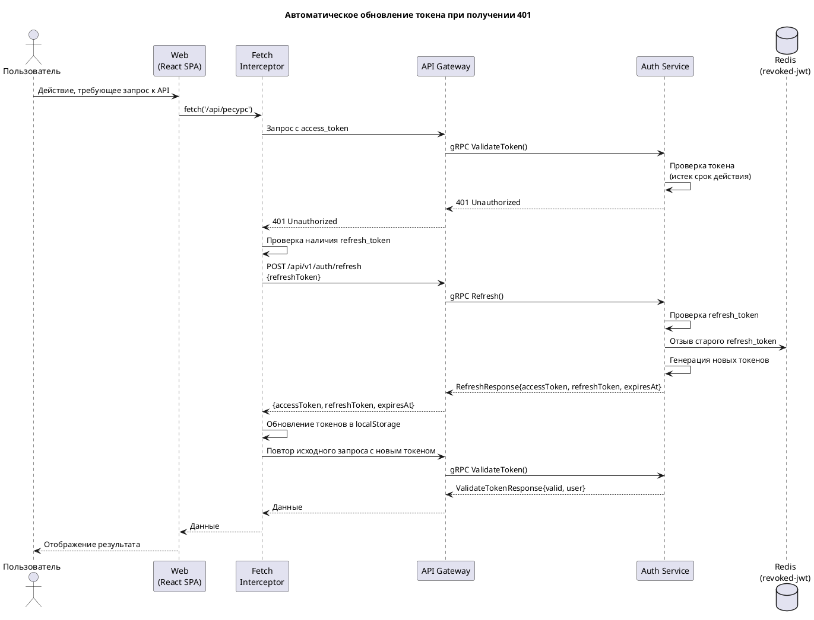
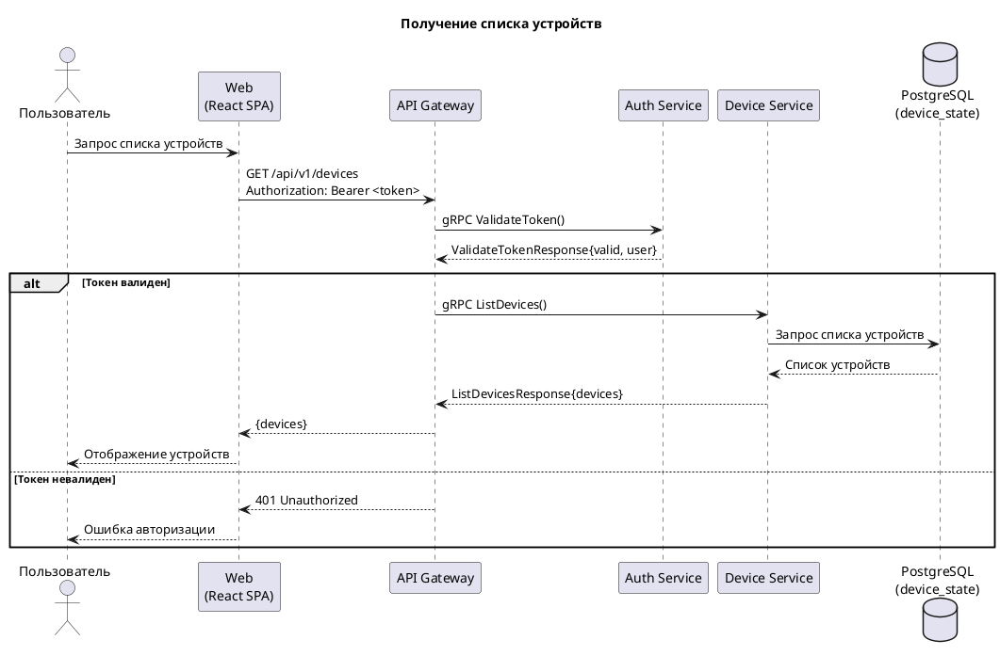
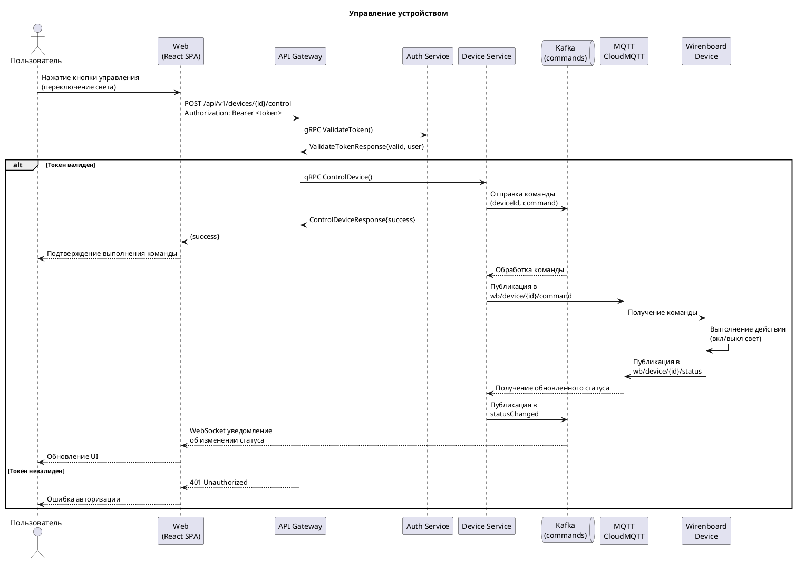
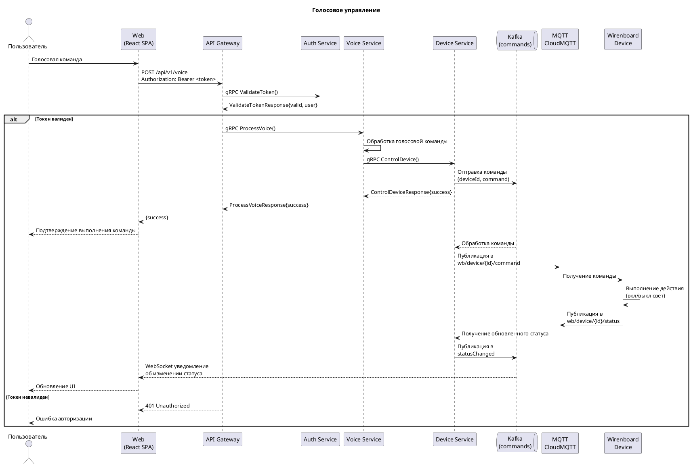

# Диаграммы последовательности взаимодействия

## Аутентификация пользователя

## Обновление токена доступа

## Автоматическое обновление токена при получении 401

## Получение списка устройств

## Управление устройством

## Голосовое управление

