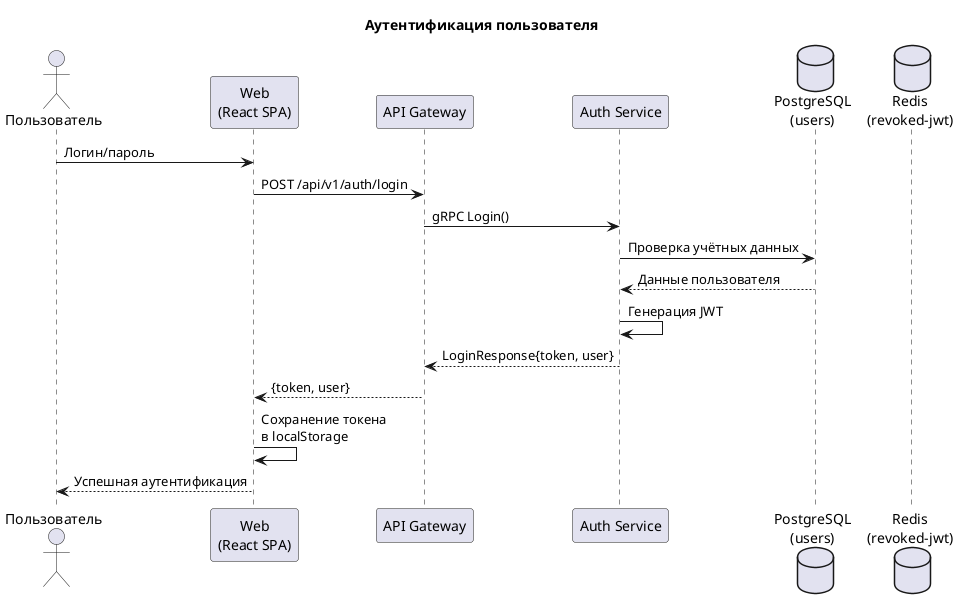
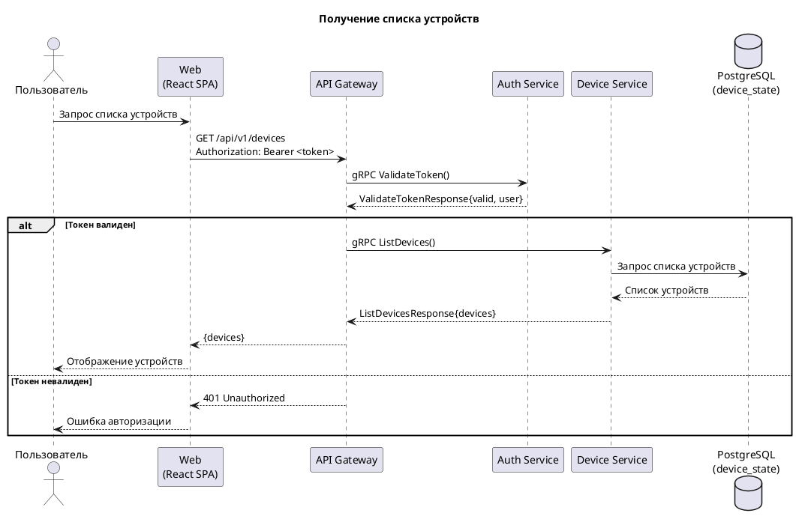
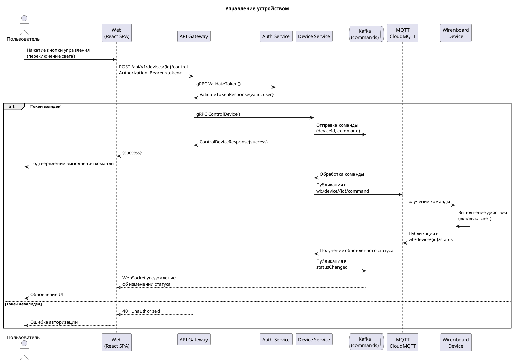
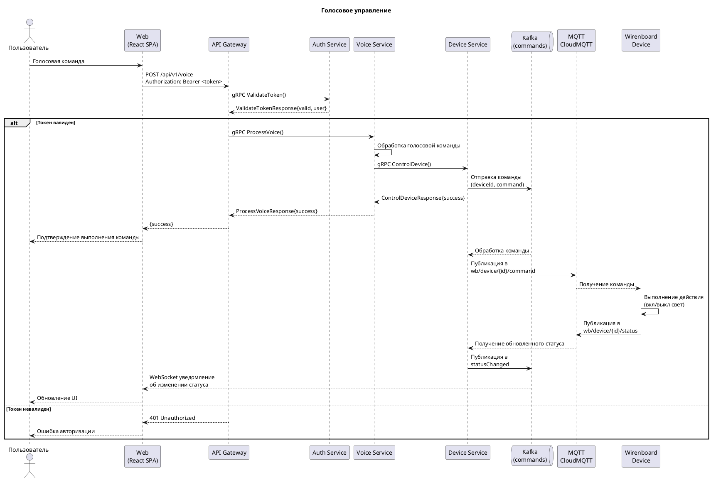

# Диаграммы последовательности взаимодействия

## Аутентификация пользователя

```plantuml
@startuml
title Аутентификация пользователя

actor Пользователь
participant "Web\n(React SPA)" as Web
participant "API Gateway" as Gateway
participant "Auth Service" as Auth
database "PostgreSQL\n(users)" as DB
database "Redis\n(revoked-jwt)" as Redis

Пользователь -> Web: Логин/пароль
Web -> Gateway: POST /api/v1/auth/login
Gateway -> Auth: gRPC Login()
Auth -> DB: Проверка учётных данных
DB --> Auth: Данные пользователя
Auth -> Auth: Генерация JWT
Auth --> Gateway: LoginResponse{token, user}
Gateway --> Web: {token, user}
Web -> Web: Сохранение токена\nв localStorage
Web --> Пользователь: Успешная аутентификация

@enduml
```

## Получение списка устройств

```plantuml
@startuml
title Получение списка устройств

actor Пользователь
participant "Web\n(React SPA)" as Web
participant "API Gateway" as Gateway
participant "Auth Service" as Auth
participant "Device Service" as Device
database "PostgreSQL\n(device_state)" as DB

Пользователь -> Web: Запрос списка устройств
Web -> Gateway: GET /api/v1/devices\nAuthorization: Bearer <token>
Gateway -> Auth: gRPC ValidateToken()
Auth --> Gateway: ValidateTokenResponse{valid, user}

alt Токен валиден
    Gateway -> Device: gRPC ListDevices()
    Device -> DB: Запрос списка устройств
    DB --> Device: Список устройств
    Device --> Gateway: ListDevicesResponse{devices}
    Gateway --> Web: {devices}
    Web --> Пользователь: Отображение устройств
else Токен невалиден
    Gateway --> Web: 401 Unauthorized
    Web --> Пользователь: Ошибка авторизации
end

@enduml
```

## Управление устройством

```plantuml
@startuml
title Управление устройством

actor Пользователь
participant "Web\n(React SPA)" as Web
participant "API Gateway" as Gateway
participant "Auth Service" as Auth
participant "Device Service" as Device
queue "Kafka\n(commands)" as Kafka
participant "MQTT\nCloudMQTT" as MQTT
participant "Wirenboard\nDevice" as WB

Пользователь -> Web: Нажатие кнопки управления\n(переключение света)
Web -> Gateway: POST /api/v1/devices/{id}/control\nAuthorization: Bearer <token>
Gateway -> Auth: gRPC ValidateToken()
Auth --> Gateway: ValidateTokenResponse{valid, user}

alt Токен валиден
    Gateway -> Device: gRPC ControlDevice()
    Device -> Kafka: Отправка команды\n(deviceId, command)
    Device --> Gateway: ControlDeviceResponse{success}
    Gateway --> Web: {success}
    Web --> Пользователь: Подтверждение выполнения команды
    
    Kafka --> Device: Обработка команды
    Device -> MQTT: Публикация в\nwb/device/{id}/command
    MQTT --> WB: Получение команды
    WB -> WB: Выполнение действия\n(вкл/выкл свет)
    WB -> MQTT: Публикация в\nwb/device/{id}/status
    MQTT --> Device: Получение обновленного статуса
    Device -> Kafka: Публикация в\nstatusChanged
    
    Kafka --> Web: WebSocket уведомление\nоб изменении статуса
    Web --> Пользователь: Обновление UI
else Токен невалиден
    Gateway --> Web: 401 Unauthorized
    Web --> Пользователь: Ошибка авторизации
end

@enduml
```

## Голосовое управление

```plantuml
@startuml
title Голосовое управление

actor Пользователь
participant "Web\n(React SPA)" as Web
participant "API Gateway" as Gateway
participant "Auth Service" as Auth
participant "Voice Service" as Voice
participant "Device Service" as Device
queue "Kafka\n(commands)" as Kafka
participant "MQTT\nCloudMQTT" as MQTT
participant "Wirenboard\nDevice" as WB

Пользователь -> Web: Голосовая команда
Web -> Gateway: POST /api/v1/voice\nAuthorization: Bearer <token>
Gateway -> Auth: gRPC ValidateToken()
Auth --> Gateway: ValidateTokenResponse{valid, user}

alt Токен валиден
    Gateway -> Voice: gRPC ProcessVoice()
    Voice -> Voice: Обработка голосовой команды
    Voice -> Device: gRPC ControlDevice()
    Device -> Kafka: Отправка команды\n(deviceId, command)
    Device --> Voice: ControlDeviceResponse{success}
    Voice --> Gateway: ProcessVoiceResponse{success}
    Gateway --> Web: {success}
    Web --> Пользователь: Подтверждение выполнения команды
    
    Kafka --> Device: Обработка команды
    Device -> MQTT: Публикация в\nwb/device/{id}/command
    MQTT --> WB: Получение команды
    WB -> WB: Выполнение действия\n(вкл/выкл свет)
    WB -> MQTT: Публикация в\nwb/device/{id}/status
    MQTT --> Device: Получение обновленного статуса
    Device -> Kafka: Публикация в\nstatusChanged
    
    Kafka --> Web: WebSocket уведомление\nоб изменении статуса
    Web --> Пользователь: Обновление UI
else Токен невалиден
    Gateway --> Web: 401 Unauthorized
    Web --> Пользователь: Ошибка авторизации
end

@enduml
``` 